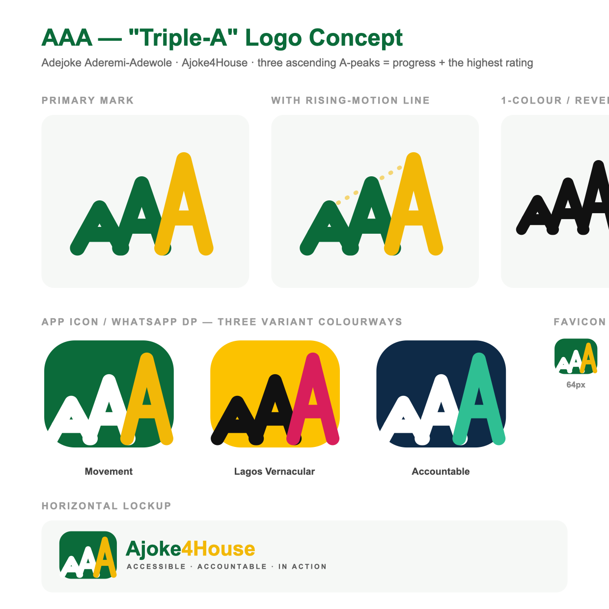

# Ajoke4House — Logo Assets ("Triple-A" / AAA)

Starter logo concept: **three ascending "A" peaks** — read at once as the initials **A.A.A.**, as **rising mountains / progress**, and as a **top ("triple-A") rating**. The peak doubles as a rooftop — a nod to the *House* of Assembly and "Ajoke4House." The tallest peak is set in the accent colour: *rising to the gold standard.*

## Files
| File | Use |
|---|---|
| `aaa_mark_color.svg` | Primary mark (green + gold), transparent background |
| `aaa_mark_mono.svg` | 1-colour (black) — for cheap print: shirts, stamps, posters |
| `aaa_mark_reversed.svg` | White mark for dark backgrounds |
| `aaa_badge_movement.svg` | App icon / WhatsApp DP — Variant A (Movement) colours |
| `aaa_badge_lagos.svg` | App icon / WhatsApp DP — Variant B (Lagos Vernacular) colours |
| `aaa_badge_accountable.svg` | App icon / WhatsApp DP — Variant C (Accountable) colours |
| `aaa_favicon.svg` | Favicon (square) |
| `aaa_lockup_horizontal.svg` | Icon + "Ajoke4House" wordmark + tagline |
| `aaa_concept_sheet.svg` / `.png` | Preview of the whole system |

## Colours
- **Movement:** green `#0B6B3A`, gold `#F2B807`
- **Lagos Vernacular:** yellow `#FCC200`, magenta `#D81E5B`, ink `#111111`
- **Accountable:** navy `#0E2A47`, emerald `#2FBF93`

## Notes
- SVG is infinitely scalable and tiny (~1 KB each) — ideal for low-data mobile. Recolour by editing the hex values.
- The wordmark uses **Plus Jakarta Sans / Montserrat** (Arial fallback). For final art, outline the text in the chosen brand font.
- This is a **starter** concept to hand to claude.ai/design (Follow-up Prompt #2) or a designer to refine. It should sit **alongside the official NDC party logo** on the site once that art is confirmed.
